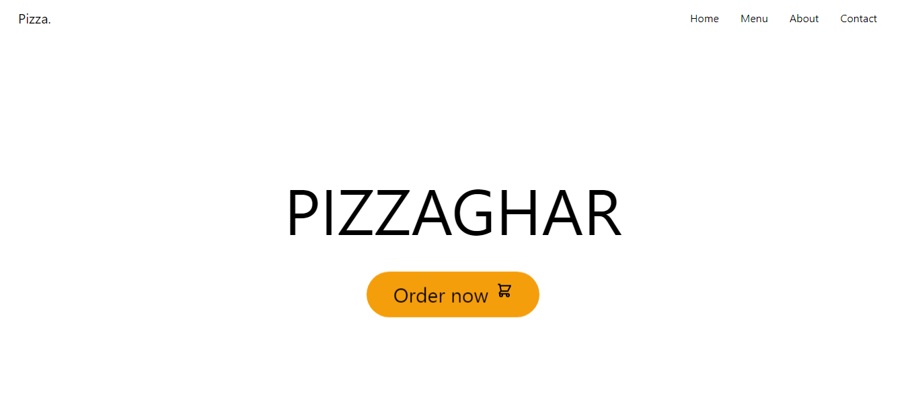
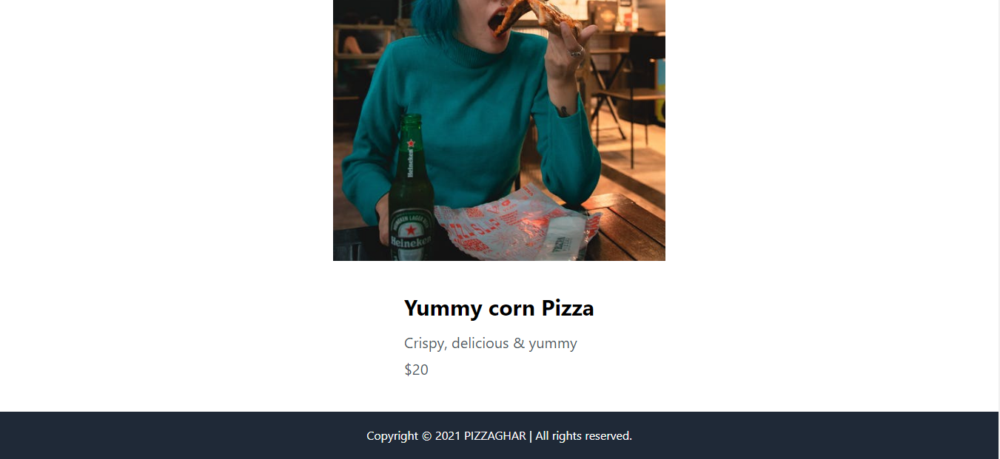

# Welcome to the React Pizza App 🍕
It is a simple React pizza website using React and Tailwind. This app helps people practice their tailwind skills and react routing concept.

## 💻Tech Stack
<br>


<br>


### How to get the form on your local machine:

---

- Download or clone the repository

```
git clone https://github.com/Ayushparikh-code/Web-dev-mini-projects.git
```

- Go to the directory
- Open react-tailwind-css folder
- Open the terminal and run 
```
yarn / npm start
```
- The app will open in the browser.


<br>

##Screenshots


<br>


<br>


## Happy Coding!

